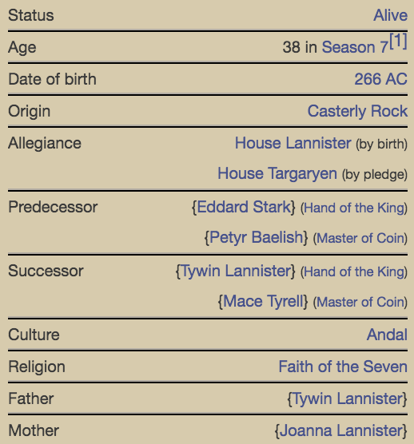

Warm-Up 01 - Stat 133, Spring 2018
================

**Due date:** Friday Feb-02, 2018 (before midnight)

The purpose of this assignment is to work with an `Rmd` file and practice writing content using markdown syntax.

You will be using R markdown files, aka `Rmd` files, throughout the rest of the course. So the sooner you get familiar with the markdown syntax, the better. Hopefully, after finishing the course, you will ditch (or at least minimize the use of) office-like software and switch to a combination of markdown file(s)---with R or other compatible software---to make your assignments or prepare any other type of dynamic document.

Although this HW is a *warm-up* assignment (i.e. it won't count towards your final grade), please take it as an inexpensive opportunity to tackle any logistic problems, and make sure R, RStudio, bCourses, and your computer work nicely---without being penalized. Later on you will also include version control tools such as Git and Github.

Here are some useful resources that you can consult to complete this assignment:

-   Markdown tutorial by CommonMark: <http://commonmark.org/help/tutorial/>
-   [www.markdown-tutorial.com](http://www.markdown-tutorial.com)
-   [www.markdowntutorial.com](http://www.markdowntutorial.com/)
-   Mastering Markdown: <https://guides.github.com/features/mastering-markdown/>
-   Markdown reference: <http://commonmark.org/help/>
-   Adam Pritchard's [Markdown Cheatsheet](https://github.com/adam-p/markdown-here/wiki/Markdown-Cheatsheet)
-   RStudio cheat sheet: <https://www.rstudio.com/wp-content/uploads/2016/01/rstudio-IDE-cheatsheet.pdf>

------------------------------------------------------------------------

Requirements
------------

Here's a summary of the topics you have to write about. You don't have to write any R code (yet).

1.  [Cooking Recipe](#cooking-recipe)
2.  [Game of Thrones](#game-of-thrones)
3.  [Quadratic Equation](#quadratic-equation)
4.  [Comments and Reflections](#comments-and-reflections)

Make sure to include the following elements (using markdown syntax)

-   Use various types of headings
-   Use text in italics
-   Use text in bold
-   Hyperlinks
-   Links of images
-   A table
-   Unordered list
-   Ordered list
-   Blockquote
-   Breaklines
-   Some math equations

### 1) Cooking Recipe

Visit *Smitten Kitchen* (<https://smittenkitchen.com>) and choose one recipe (e.g. [root vegetable gratin](https://smittenkitchen.com/2016/11/root-vegetable-gratin/)). Write about the recipe using Markdown syntax:

-   Use an **unordered** list (of bullets) to list the ingredients.
-   Use another unordered list to list any "special" kitchen tools that are needed.
-   Describe the steps of the recipe.
-   Include an image to show the appearance of the meal.
-   Is there a special season of the year for it?
-   Are there variations of the recipe? Using other ingredients?

### 2) Game of Thrones

Visit *Game of Thrones Wiki* (<http://gameofthrones.wikia.com>) and choose one of the characters (e.g. [Tyrion Lannister](http://gameofthrones.wikia.com/wiki/Tyrion_Lannister)). Write the following about the character you chose:

-   Include one of the character's quote using a markdown blockquote.
-   Include an image of the character.
-   Use a markdown table with two columns to include things like status, date of birth, origin, allegiance, etc (see screen-shot below)

### 3) Quadratic Equation

Visit the wikipedia page for the quadratic equation: <https://en.wikipedia.org/wiki/Quadratic_equation>

Write the general form of a quadratic equation, and provide a brief description for it:

Write the quadratic formula for the roots of the general quadratic equation:

Also, write the derivation of the solution:

To write all the above equations you will have to use latex syntax. Here are a couple of resources about writing math symbols with Latex notation:

-   <https://www.sharelatex.com/learn/Mathematical_expressions>

-   <https://en.wikibooks.org/wiki/LaTeX/Mathematics>

If you feel the quadratic is not enough, feel free to find other math equations and formulas to play with.

### 3) Comments and Reflections

Reflect on what was hard/easy, problems you solved, helpful tutorials you read, etc. Here are some questions that you can start with to provide comments on your HW.

-   What things were hard, even though you saw them in class?
-   What was easy(-ish) even though we haven't done it in class?
-   Was this the first time you were using markdown? If yes, how do you feel about it?
-   If you have used markdown before, was there something new you learned while doing this assignment?
-   Did you need help to complete the assignment? If so, what kind of help? Who helped you?
-   How much time did it take to complete this HW?
-   What was the most time consuming part?

------------------------------------------------------------------------

Submission
----------

Name your `Rmd` file using the following structure: `up01-first-last.Rmd` where "first" and "last" are your first and last names. E.g. `up01-gaston-sanchez.Rmd`.

Please submit your source `.Rmd` file, as well as the knitted (i.e. compiled) html file to bCourses.

*Note: later (in two weeks or so) you will have to upload your `.Rmd` file to your github repository (don't worry if you don't know what this means).*
